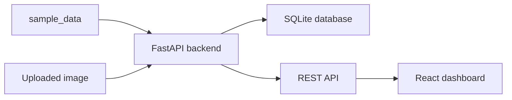

# VisionOps

VisionOps is a local computer vision experiment management and failure analysis platform. It is designed as a portfolio-ready ML systems project around WildNight / YOLO experiments.

Phase 1 focuses on a Demo Mode MVP loop: import bundled sample data, understand the project story, compare experiments, inspect visual failure cases, and run a deterministic demo inference flow.

## Motivation

YOLO experiment artifacts often live across scripts, CSV files, image folders, checkpoints, and notes. VisionOps turns those scattered outputs into a structured dashboard that can answer:

- Which experiments were run?
- Which model has the best mAP and speed tradeoff?
- What happened inside one selected model run?
- What failure cases are worth showing?
- How would a single-image inference API fit into the system?

## Key Features

- FastAPI backend with SQLite persistence.
- React + TypeScript dashboard built around a reviewer-friendly product story.
- Demo Mode sample import that works without real WildNight data.
- Experiment comparison table with dynamic metric charts parsed from recorded CSV columns.
- Model run detail page with metrics, curve, related visual cases, and analysis.
- Failure gallery for visual detection cases.
- Inference Demo that records uploads and returns a clear deterministic demo result.
- Demo Guide page for a three-to-five-minute portfolio walkthrough.
- Docker Compose entrypoint for reproducible local startup.

## Quick Start

```bash
git clone <your-repo-url>
cd VisionOps
docker compose up --build
```

Open:

```text
http://localhost:3000
```

Click **Import Sample Data** to populate the MVP loop.

## Architecture



## Tech Stack

- Backend: Python, FastAPI, SQLite, Pandas, and an Ultralytics-ready API boundary for later phases.
- Frontend: React, TypeScript, Vite, Recharts, Axios, Lucide icons.
- Runtime: Docker and Docker Compose.
- Tests: pytest for backend API behavior.

## Demo Mode

Demo Mode imports `sample_data/manifest.json`, three synthetic experiment CSV files, and four SVG visual cases. The sample files are intentionally small and do not represent the full WildNight dataset. `results.csv` must include `epoch`; any additional numeric columns are exposed as dynamic comparison metrics.

Phase 1 keeps real WildNight import and real YOLO inference out of scope. The backend already exposes the API shape so later phases can replace the demo behavior with real experiment scanning and model execution.

## Local Development

Backend:

```bash
cd backend
python -m venv .venv
.venv\Scripts\activate
pip install -r requirements.txt
uvicorn app.main:app --reload
```

Frontend:

```bash
cd frontend
npm install
npm run dev
```

## API Overview

- `GET /api/health` checks backend and database readiness.
- `GET /api/demo-summary` returns Demo Mode story metrics for the frontend.
- `POST /api/import/sample` imports bundled Demo Mode data.
- `POST /api/import/local` is reserved for Local Research Mode.
- `GET /api/experiments` returns experiment rows with core metrics and dynamic `metrics[]` values.
- `GET /api/experiments/{id}` returns one experiment with curve points, dynamic metrics, related visual cases, and model analysis.
- `GET /api/failures` returns visual failure cases.
- `POST /api/infer` accepts one image and returns a Phase 1 demo detection.

## Data Policy

Do not commit:

- full WildNight datasets,
- large model weights,
- local SQLite databases,
- private absolute paths,
- uploaded images or inference outputs.

Use `sample_data/` for lightweight public demo assets only.

## Current Limitations

- Local Research Mode is a placeholder in Phase 1.
- The inference endpoint returns deterministic Demo Mode output instead of loading YOLO weights.
- Phase 1 prioritizes page states and product flow over real research import complexity.
- Screenshots and demo video assets are not included yet.

## Future Work

- Parse real WildNight experiment folders and YOLO `results.csv` files.
- Index real detection visualizations and failure analysis images.
- Add model selection and real Ultralytics inference.
- Add frontend tests and an end-to-end Docker acceptance test.
- Add final screenshots, demo script, and resume bullets.

## Resume Bullets

- Built VisionOps, a lightweight ML experiment management platform for computer vision research using FastAPI, React, SQLite, and Docker.
- Designed a Demo Mode data pipeline for reproducible local dashboards without committing private datasets or large model weights.
- Developed a web dashboard for comparing model performance across precision, recall, mAP, FPS, and inference time.
- Implemented an API and database foundation for experiment tracking, visual failure analysis, and future YOLO inference.
