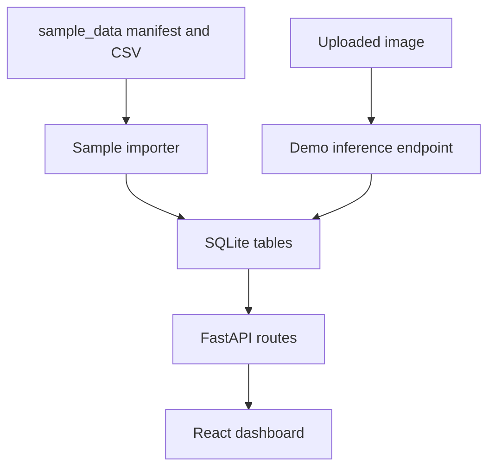

# Architecture

VisionOps Phase 1 is a local Docker Compose application with two services.

- `backend`: FastAPI service exposing REST APIs, initializing SQLite, importing sample data, and serving sample visual assets.
- `frontend`: React/Vite dashboard for overview metrics, experiment comparison, failure gallery, and inference demo.

SQLite stores metadata and paths, not large datasets or model weights.

